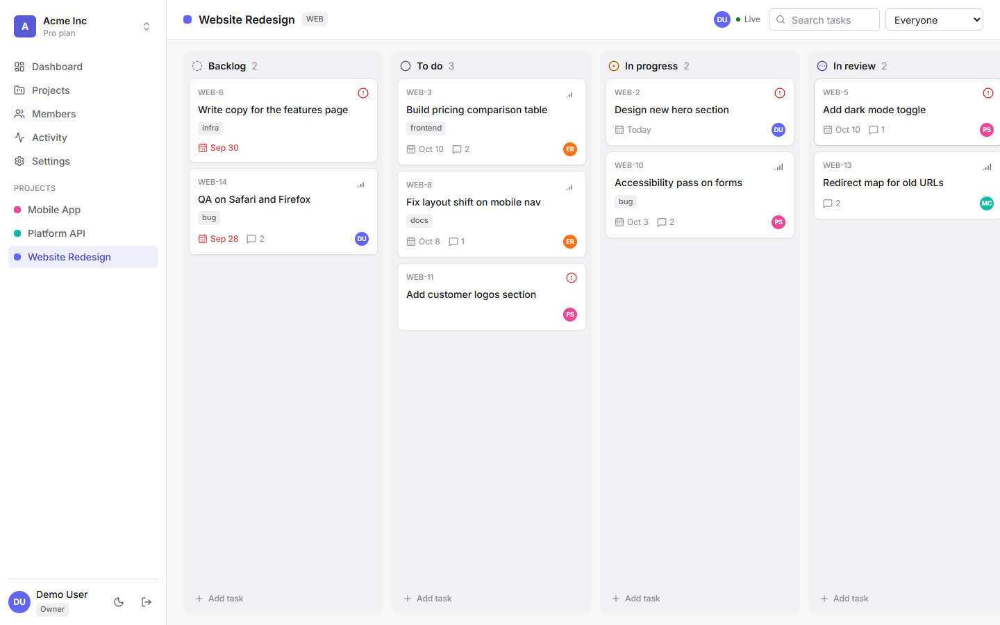
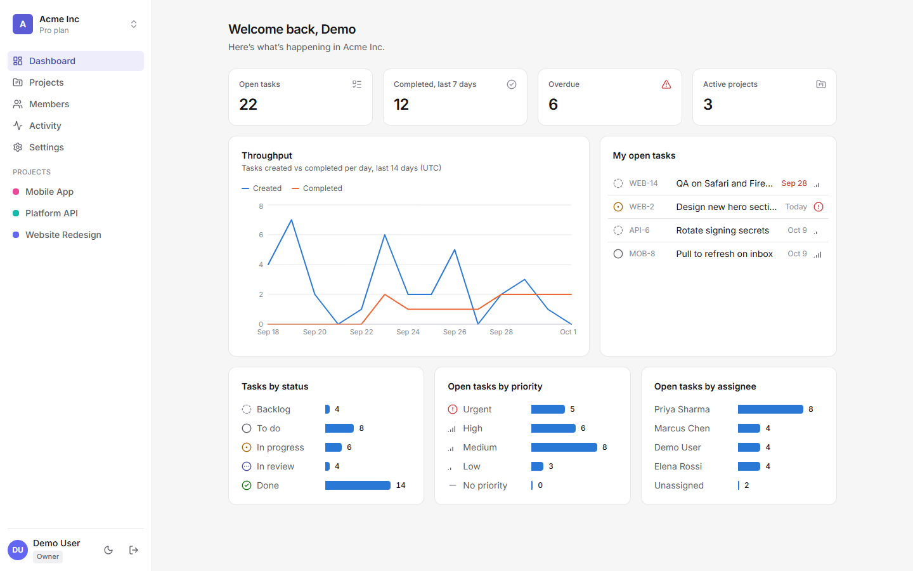
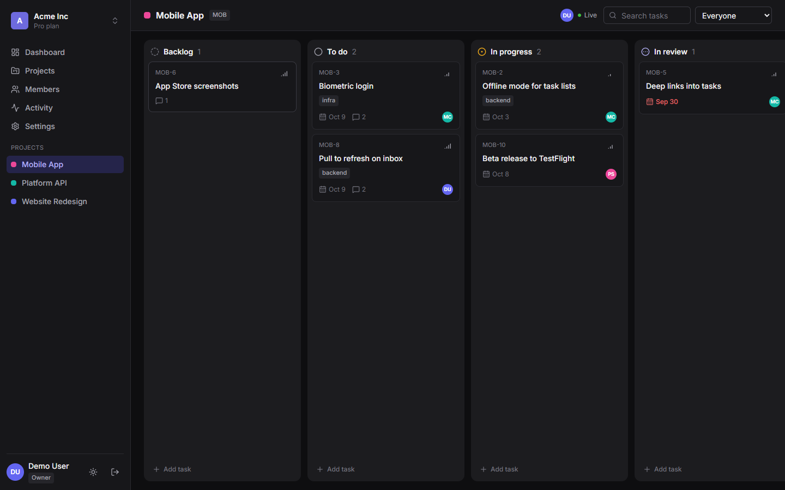
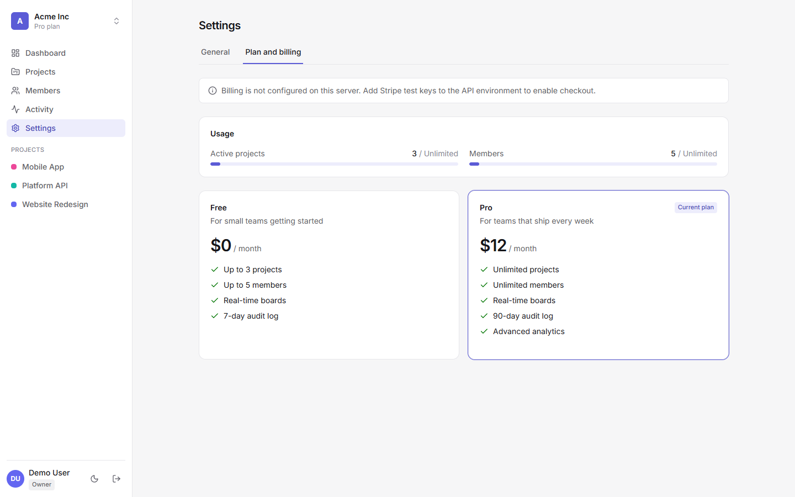

# WorkGrid

A multi-tenant project management SaaS: real-time kanban boards, role-based access, an audit trail, analytics and subscription billing. Built with MongoDB, Express, React and Node, in TypeScript end to end.



| Dashboard | Dark mode | Plans |
| --- | --- | --- |
|  |  |  |

## Try it

```bash
pnpm install
pnpm seed      # demo workspaces and users
pnpm dev       # API on :4000, web on :5173
```

Open http://localhost:5173 and choose **Explore the live demo** (`demo@workgrid.dev` / `demo1234`).
You need Node 20+, pnpm and MongoDB on `localhost:27017`. No `.env` is required for local development.

To see real-time sync, sign in as `priya@workgrid.dev` (same password) in a second browser and open the same board.

## What it does

- **Workspaces (tenants).** A user can belong to many workspaces, each at `/:slug`, with its own projects, members, plan and audit log.
- **Boards.** Drag-and-drop kanban with priorities, assignees, due dates, labels and comments. Moves are optimistic and roll back if the server refuses.
- **Real time.** Task changes, comments and "who is viewing this board" presence are pushed over Socket.IO.
- **Roles.** Owner, admin, member and viewer. One permission map is shared by the API (enforcement) and the UI (hiding what you cannot do).
- **Invites.** Link-based, single-use, expiring, and redeemable only by the invited email address.
- **Plans.** Free and Pro with server-enforced limits on projects, seats and audit history. Stripe Checkout, webhooks and the billing portal handle upgrades.
- **Audit log and analytics.** Every meaningful change is recorded; the dashboard is driven by a MongoDB `$facet` aggregation.

## Architecture

```
apps/api          Express 5 + Mongoose 9 + Socket.IO
apps/web          React 19 + Vite + Tailwind 4 + TanStack Query
packages/shared   Zod schemas, DTO types, roles and plan definitions used by both
e2e               Playwright tests against the running stack
```

### Tenant isolation

All tenants share one database, so isolation is enforced below the route handlers rather than trusted to them ([apps/api/src/lib/tenant.ts](apps/api/src/lib/tenant.ts)):

1. `resolveTenant` maps `/api/orgs/:orgSlug` to an organization the caller is a member of. Non-members get a 404, so slugs cannot be enumerated.
2. The rest of the request runs inside an `AsyncLocalStorage` context holding that org's id.
3. A Mongoose plugin on every tenant-owned model reads the context and forces `orgId` onto each query, update, delete and aggregation, overriding anything the caller supplied. New documents are stamped with it, and saving into a different tenant throws.
4. Outside a request the plugin fails closed: a query with no tenant context and no explicit `orgId` throws instead of returning every tenant's rows.

Route handlers therefore contain no `orgId` filters, and forgetting one cannot leak data. [tenancy.test.ts](apps/api/tests/tenancy.test.ts) proves it by having a member of one workspace request another workspace's ids through their own URL.

### Authentication

- Short-lived JWT access token (15 minutes), held in memory only.
- Opaque refresh token in an `httpOnly` cookie. Only its SHA-256 hash is stored, and it is rotated on every use.
- A just-rotated token stays valid for 30 seconds so two tabs refreshing at once do not log each other out.
- The client refreshes transparently on a 401, sharing one in-flight refresh across concurrent requests.

### Shared contract

Request bodies are validated on the server with the same Zod schemas the forms use on the client, and API responses are typed by shared DTO interfaces. Server validation errors come back keyed by field and are mapped onto the form.

### Real time

Sockets authenticate with the access token, then join an org room (membership checked) and project rooms (the project must belong to an org the socket has joined). The client folds events into the TanStack Query cache with idempotent upserts, so an API response and its socket echo can arrive in either order.

## Testing

```bash
pnpm typecheck
pnpm test             # API integration tests (Vitest + Supertest, real MongoDB)
pnpm seed && pnpm e2e # Playwright; set PW_CHANNEL=msedge to use an installed browser
```

The API suite covers auth and token rotation, tenant isolation, the role matrix, invites, plan limits and analytics. The e2e suite covers session restore, workspace scoping, a read-only viewer, and two signed-in users watching a board update live. GitHub Actions runs all of it on every push ([ci.yml](.github/workflows/ci.yml)).

## Configuration

Copy `apps/api/.env.example` to `apps/api/.env` to override defaults.

| Variable | Purpose |
| --- | --- |
| `MONGODB_URI` | MongoDB connection string |
| `CLIENT_URL` | Web origin, used for CORS and for links in invites and Stripe redirects |
| `JWT_ACCESS_SECRET` | Required in production |
| `STRIPE_SECRET_KEY`, `STRIPE_PRICE_PRO`, `STRIPE_WEBHOOK_SECRET` | Optional. Without them the billing page shows plans and usage but checkout is disabled |

**Stripe (test mode):**

1. Put your `sk_test_…` key in `apps/api/.env` as `STRIPE_SECRET_KEY`.
2. Run `pnpm --filter @workgrid/api stripe:setup`. It creates the "WorkGrid Pro" product, its $12/month price and a Customer Portal configuration, then prints the price id for `STRIPE_PRICE_PRO`. It refuses to run with a live key and is safe to re-run.
3. Restart the API, create a workspace you own, and upgrade with the test card `4242 4242 4242 4242`.

No webhook forwarding is needed locally. When the browser returns from Checkout or the portal, the client calls `POST /billing/sync`, which re-reads the workspace's latest subscription from Stripe. In production, also add a webhook endpoint for `/api/billing/webhook` (events `checkout.session.completed` and `customer.subscription.*`) and set `STRIPE_WEBHOOK_SECRET`, so changes made outside the app, such as a renewal failing, are picked up too.

## Deploying for free

| Piece | Host | Notes |
| --- | --- | --- |
| Database | MongoDB Atlas M0 | Allow access from anywhere, since Render's free IPs are not static |
| API | Render free web service | [render.yaml](render.yaml) is a ready blueprint. Free instances sleep when idle, so the first request after a pause is slow |
| Web | Vercel | Set the root directory to `apps/web` |

1. Deploy the API and note its URL.
2. In [apps/web/vercel.json](apps/web/vercel.json), replace `YOUR-API.onrender.com`. Vercel then proxies `/api` to Render, which keeps the refresh cookie first-party (Safari blocks third-party cookies).
3. On Vercel set `VITE_SOCKET_URL` to the API URL. WebSockets cannot go through the proxy, so the socket connects to Render directly and authenticates with the access token.
4. On Render set `CLIENT_URL` to the Vercel URL, then run `pnpm seed` once against the Atlas URI to create the demo account.

`docker compose up --build` runs the whole stack behind nginx at http://localhost:8080.

## Known limits

- Presence is held in memory, so the API must run as a single instance. Scaling out needs the Socket.IO Redis adapter.
- Invites are shared as links; there is no email delivery.
- Card order uses fractional positions and is never rebalanced, which is fine for boards of this size.
